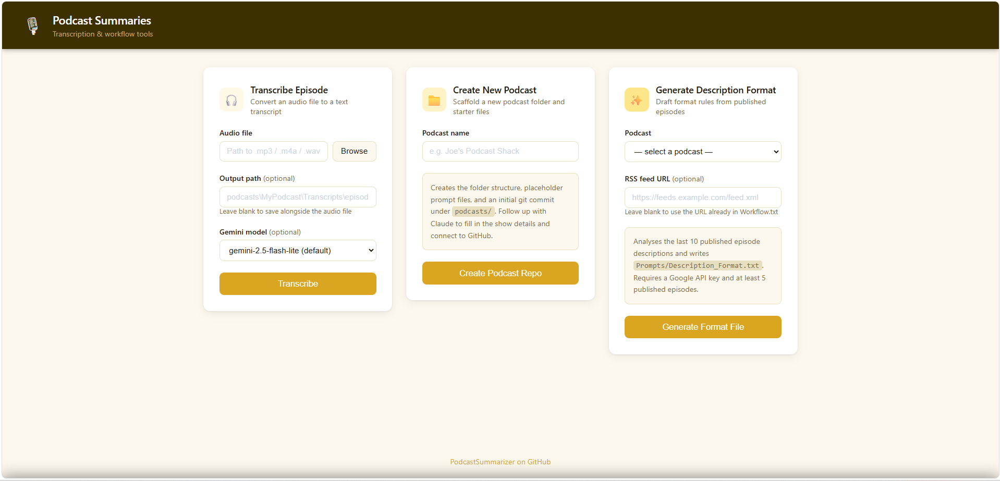

# Podcast Summaries

A shared workspace for managing multiple podcast workflows with Claude Code.



---

## Introduction

This workspace keeps the tools and podcasts organised in one place. Each podcast
lives in its own independent git repository under `podcasts/`. The shared tools
live here at the root.

**Claude Code is the main interface.** You give it a file and a direction — "transcribe
this episode", "run the summary workflow", "set up a new podcast called X" — and it
handles the rest: transcribing audio, syncing descriptions from the RSS feed, writing
the episode summary, looking up URLs, and committing the results.

A few things can also be run directly as Python scripts without Claude (see
[Technical](#technical)).

---

## Installing

**Python package** (for transcription and format generation):
```
pip install google-genai
```

**ffmpeg** — required for audio transcription; must be on your PATH:
- Windows: `winget install ffmpeg`
- Mac: `brew install ffmpeg`
- Linux: `sudo apt install ffmpeg`

**Google API key** — required for transcription and format generation:
```
# Windows (PowerShell — permanent, user-level)
[System.Environment]::SetEnvironmentVariable("GOOGLE_API_KEY", "your-key-here", "User")

# Mac/Linux
export GOOGLE_API_KEY="your-key-here"
```
Get a key at [Google AI Studio](https://aistudio.google.com/app/apikey).

---

## Using

Open this folder in Claude Code and tell it what you need:

| What you say | What Claude does |
|---|---|
| "I have a new episode to transcribe: [path]" | Transcribes the audio and saves the transcript |
| "Run the summary workflow" | Syncs RSS descriptions, writes the episode summary, looks up URLs, commits |
| "Create a new podcast repo called [Name]" | Scaffolds the folder, gathers show info, generates the format file, connects GitHub |
| "Regenerate the description format for [podcast]" | Re-analyses the RSS feed and updates `Description_Format.txt` |

Each podcast has a `Workflow.txt` that Claude reads to understand the steps for that
specific show. The `Prompts/Description_Format.txt` in each podcast folder tells Claude
how that show's descriptions are structured — no sample text, just rules and layout.

---

## Technical

### How transcription works

`transcribe_episode.py` splits the audio into 12-minute chunks with 30-second overlaps,
sends each chunk to the Gemini API, stitches the results back together, and removes the
temporary audio files. The overlap helps handle words that fall on a chunk boundary.
Default model: `gemini-2.5-flash-lite`. Pass `--model gemini-2.5-pro` for higher
accuracy on difficult audio.

### Scripts you can run directly

These three tasks can be run without Claude:

**Transcribe an episode:**
```
python transcribe_episode.py "path\to\audio.mp3" "podcasts\MyPodcast\Transcripts\output.txt"
```

**Scaffold a new podcast repo:**
```
python create_podcast.py "My Podcast Name"
```
Creates the folder structure, placeholder files, and an initial git commit under
`podcasts/`. Follow `New_Podcast_Setup.txt` to complete the setup.

**Generate or refresh a podcast's description format:**
```
python generate_description_format.py "podcasts/My Podcast"
```
Fetches the RSS feed (reads the URL from `Workflow.txt`), analyses the last 10
published episode descriptions with Gemini, and writes `Prompts/Description_Format.txt`.
Requires `GOOGLE_API_KEY` and the RSS URL set in `Workflow.txt`.

### Folder structure

```
Podcast Summaries/
  transcribe_episode.py           ← shared transcription script
  create_podcast.py               ← scaffold a new podcast repo
  generate_description_format.py  ← draft Description_Format.txt from RSS
  New_Podcast_Setup.txt           ← interactive setup workflow for Claude
  podcasts/
    MyPodcast/                    ← independent git repo
      Workflow.txt                ← per-podcast workflow Claude follows
      Prompts/
        Description_Format.txt   ← layout/style rules (no sample text)
        Episode_Summary_Template.txt
        New_Episode_Summary_Prompt.txt
        Transcription_Prompt.txt
      Episode Summaries/
      Transcripts/
```

The `podcasts/` folder is ignored by this repo. Audio files are excluded from
all repos via `.gitignore` — only transcripts and summaries are committed.
